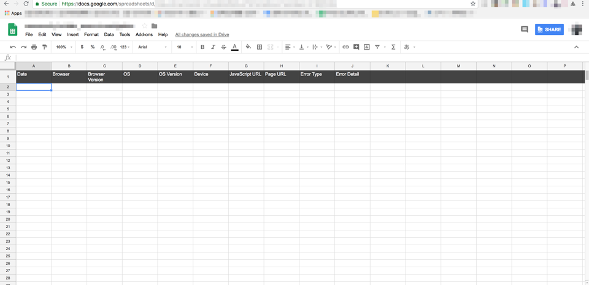
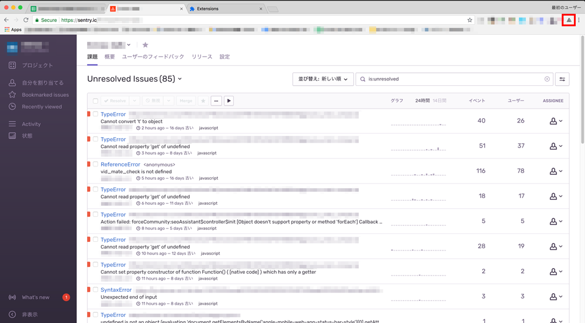
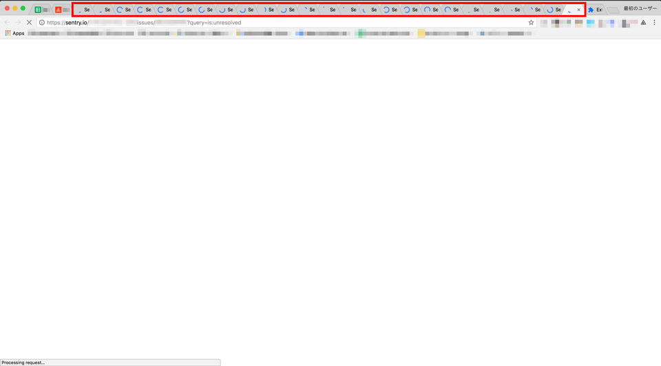
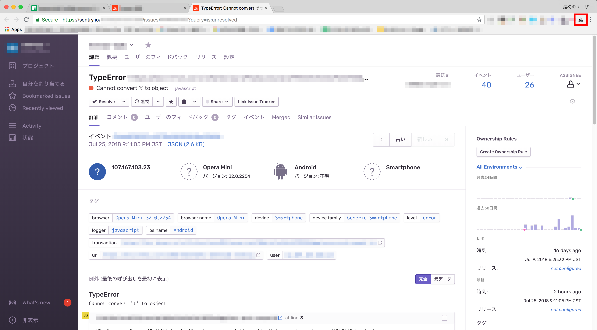
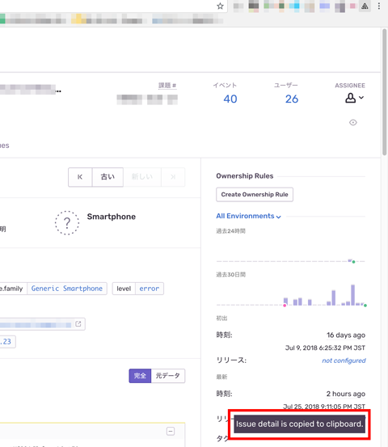
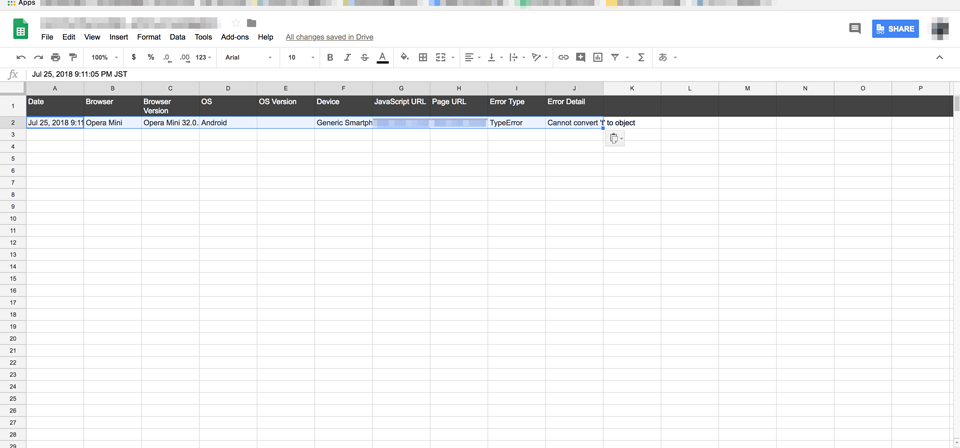

# copy-sentry-issues-to-clipboard-for-csv

## Introduction

This is Google Chrome Extension which enables copy Sentry issues to clipboard text for CSV. This extension does not have any official relationship with https://sentry.io/ .

## Usage

```
$ npm i
$ npm start
```

Then `dest` file will be generated. You can load this as unpacked extension to your Google Chrome.

Next, prepare spreadsheet for issues reporting. Sorry, I don't have any other format.



OK, open Sentry issues page.



When you press extension button, all of detail pages included in issues list automatically open. Loading may needed some seconds...



Each issue detail pages, press extension button again would copy required datum to clipboard. Small notification appears on display.




At last, you can paste the datum to your spreadsheet. You only need to repeat the work continuously...



## Contribute

Yes, I know you have other genius solution. Please let me know with your pull request.

## LICENSE

MIT.
